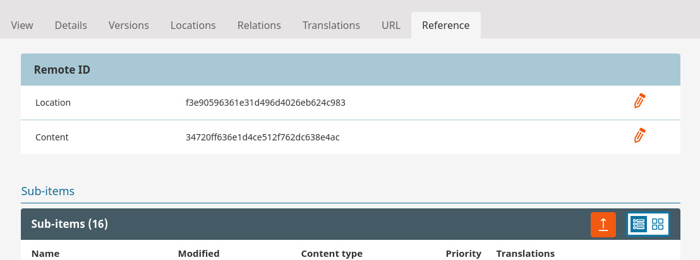
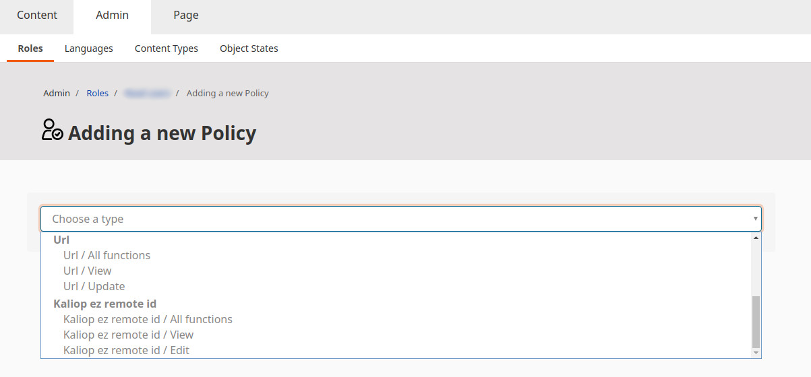
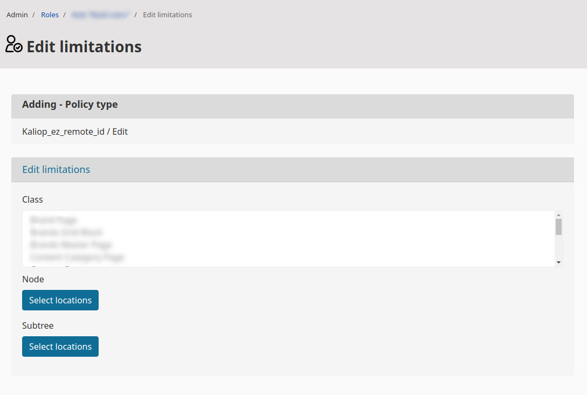

# KaliopEzRemoteIdBundle


Bundle adds Reference tab in location view in admin panel where the remoteID can be changed by user with right
permissions.



## Instalation

```bash
composer require kaliop/kaliop-ez-remoteid-bundle
```

1. Enable bundle in kernel

    ```php
        public function registerBundles()
        {
            // ...

            $bundles = [
                // ...

                new Kaliop\EzRemoteIdBundle\KaliopEzRemoteIdBundle()
            ];

            // ...
        }
    ```

2. Add KaliopEzRemoteIdBundle to assetic configuration.

    ```yaml
    assetic:
        bundles:
          # ...
          - KaliopEzRemoteIdBundle
    ```

3. Import routings in app/config/routing.yml

    ```yaml
    kaliop_remote_id:
        resource: "@KaliopEzRemoteIdBundle/Resources/config/routing.xml"
        prefix:   /
    ```

4. Clear cache

    ```
    php bin/console cache:clear
    ```

5. Install assets

    ```bash
    php bin/console assets:install --symlink --relative
    ```

6. Configure permissions by adding the right policies. The view policy is for showing the Reference tab in the location
view. Edit enable user to change the remote ID.




